# BASIC SETUP
	apt update
	apt upgrade
	apt install -y git snap certbot
	snap install docker
	docker pull jenkinsci/blueocean
	docker pull jwilder/nginx-proxy

# CERT GEN
	certbot certonly

# JENKINS DOCKER 
    docker run --name jenkins-blueocean --rm
    --detach \
    --user root \
    --volume /var/run/docker.sock:/var/run/docker.sock \
    --volume jenkins-data:/var/jenkins_home \
    --volume "$HOME":/home \
    --volume /home/ubuntu/Desktop/test:/var/test:ro \
    --publish 8080:8080 \
    jenkinsci/blueocean

# JENKINS NGINX PROXY
    docker run \
    -d \
    --name jenkins-proxy \
    -p 8443:8443 \
    -v /var/run/docker.sock:/tmp/docker.sock:ro \
    -v /root/aascerts/jenkins:/etc/nginx/certs \
    -e HTTPS_PORT=8443 \
    jwilder/nginx-proxy

# WEB APP NGINX PROXY
	docker run \
	-d \
	--name app-proxy \
	-p 443:443 \
	-v /var/run/docker.sock:/tmp/docker.sock:ro \
	-v /root/aascerts/:/etc/nginx/certs \
	-e HTTPS_PORT=443 \
	jwilder/nginx-proxy

# JENKINS SETUP FOR DEPENDENCY CHECK 
1. Create pipeline
2. Under "Build Triggers", enable "GitHub hook trigger for GITScm polling"
3. Change Pipeline Definition to "Pipeline script from SCM"
4. Change SCM to "Git"
5. Fill in the rest, change branch specifier to "main" (most of the times, since Github change from master to main sometime last year)
6. Link GitHub using hook + access token
7. Create Jenkinsfile in GitHub


# Docker Cheatsheet
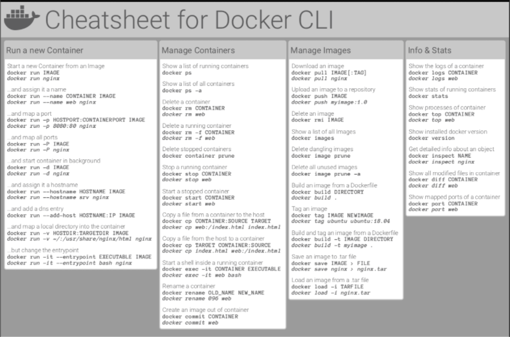

# Set up Git repo
## Locally
1. Mount folder to docker
`-v /home/gitfolder/:/var/something/:ro`

2. 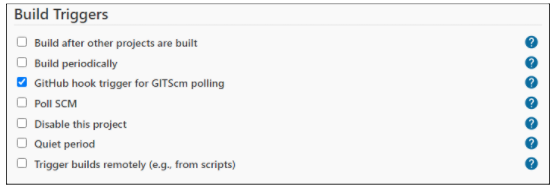
3. 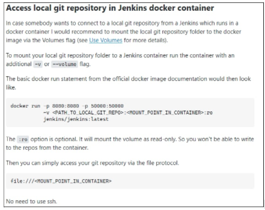
4. 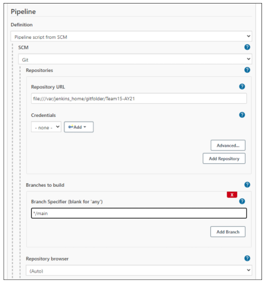

## Remote
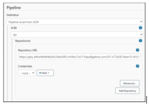

# Jenkinsfile for OWASP Dependency Checker
```
pipeline {
	agent any
	stages {
		stage('Checkout SCM') {
			steps {
				git '/home/JenkinsDependencyCheckTest'
			}
		}

		stage('OWASP DependencyCheck') {
			steps {
				dependencyCheck additionalArguments: '--format HTML --format XML', odcInstallation: 'Default'
			}
		}
	}	
	post {
		success {
			dependencyCheckPublisher pattern: 'dependency-check-report.xml'
		}
	}
}

```

# Installing OWASP Dependency Check
1. Go to Plugin Manager > search for Owasp Dependency Checker
2. Go to Manage Jenkins > Global Tool Configuration
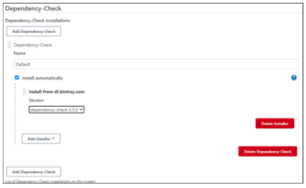

# Suppress OWASP Dependency Check false positive
1. After running the owasp dependency check, it will output the dependency-check-output.html.
2. Browse to it and save it as HTML.
3. Open the HTML, you will be able to expand the suppression and copy out the related XML code to be paste in the suppression.xml.
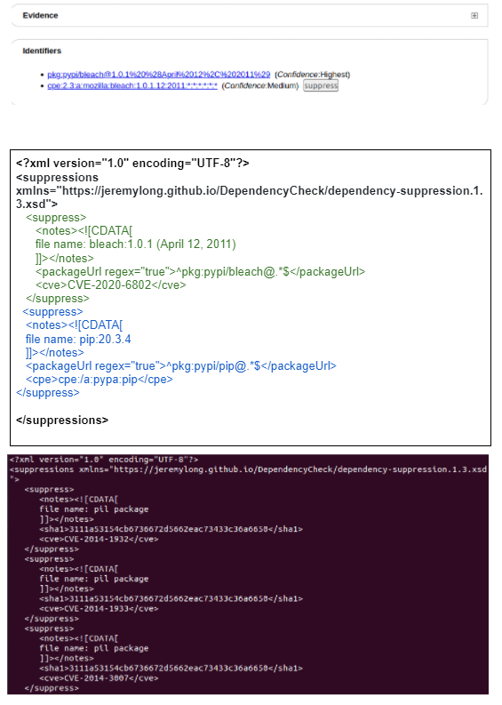

# Sonarqube
1. Install sonarqube scanner on plugins page
2. Install sonarqube docker `sudo docker pull sonarqube`
3. Run sonarqube docker
	```
	docker run -d \
	--name sonarqube \
	-e SONAR_ES_BOOTSTRAP_CHECKS_DISABLE=true \
	-p 9000:9000 \
	sonarqube:latest
	```
4. Login into port 9000  - access the sonarqube page 
5. Click Manually and create a project
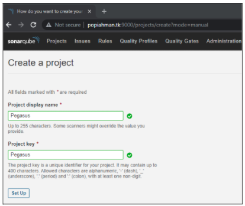
6. Click Locally
7. Generate a token. *SAVE THIS TOKEN FOR THE SERVER AUTHENTICATION LATER*
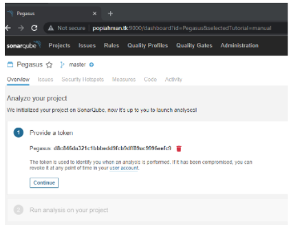
8. Continue and everything and *select correct parameters*
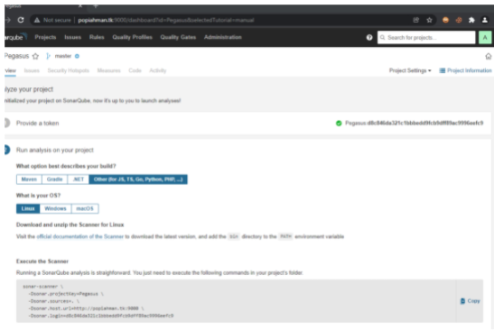
9. *Copy scanner info*
10. Go *Manage jenkins* > *Configure system* > *Add sonarqube*
11. Configure the settings and under Server authentication token, add the secret key as shown below by clicking the *Add* button to the right
12. Go Global Tool Configuration > Sonarqube scanner
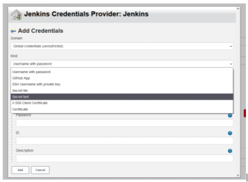
