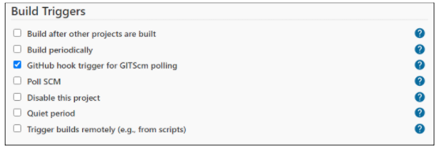
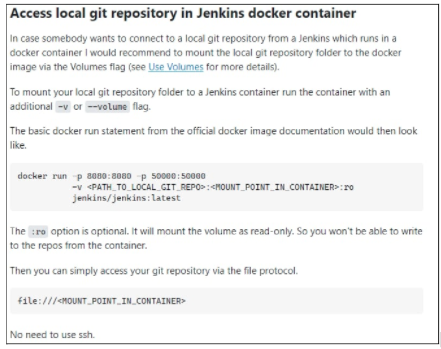
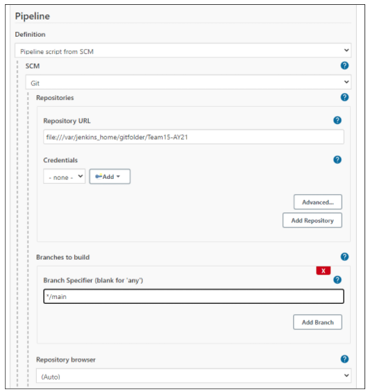

# BASIC SETUP
	apt update
	apt upgrade
	apt install -y git snap certbot
	snap install docker
	docker pull jenkinsci/blueocean
	docker pull jwilder/nginx-proxy

# CERT GEN
	certbot certonly

# JENKINS DOCKER 
    docker run --name jenkins-blueocean --rm
    --detach \
    --user root \
    --volume /var/run/docker.sock:/var/run/docker.sock \
    --volume jenkins-data:/var/jenkins_home \
    --volume "$HOME":/home \
    --volume /home/ubuntu/Desktop/test:/var/test:ro \
    --publish 8080:8080 \
    jenkinsci/blueocean

# JENKINS NGINX PROXY
    docker run \
    -d \
    --name jenkins-proxy \
    -p 8443:8443 \
    -v /var/run/docker.sock:/tmp/docker.sock:ro \
    -v /root/aascerts/jenkins:/etc/nginx/certs \
    -e HTTPS_PORT=8443 \
    jwilder/nginx-proxy

# WEB APP NGINX PROXY
	docker run \
	-d \
	--name app-proxy \
	-p 443:443 \
	-v /var/run/docker.sock:/tmp/docker.sock:ro \
	-v /root/aascerts/:/etc/nginx/certs \
	-e HTTPS_PORT=443 \
	jwilder/nginx-proxy

# JENKINS SETUP FOR DEPENDENCY CHECK 
1. Create pipeline
2. Under "Build Triggers", enable "GitHub hook trigger for GITScm polling"
3. Change Pipeline Definition to "Pipeline script from SCM"
4. Change SCM to "Git"
5. Fill in the rest, change branch specifier to "main" (most of the times, since Github change from master to main sometime last year)
6. Link GitHub using hook + access token
7. Create Jenkinsfile in GitHub

# Docker Cheatsheet

# Set up Git repo
## Locally
1. Mount folder to docker
	-v /home/gitfolder/:/var/something/:ro

2. 
3. 
4. 

